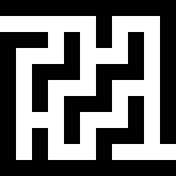

# Image File
maze-graph-pathfinding is able to take a common image file and parse it as a tile grid and into a node graph. Image files are handled using the [JIMP](https://github.com/oliver-moran/jimp) library.

---

##### Rules:
* Image files must be 20MB or smaller.
* Image dimensions must be 50000x50000 or smaller.
* The parsed tile grid must be 500x500 or smaller. This means that pixels can be parsed into tiles of up to 100x100.

---

#### Example:

Source: [Maze Generator](https://keesiemeijer.github.io/maze-generator)
Date: 2020-10-15
Wall Thickness: 20
Columns: 5
Rows: 5
Remove Maze Walls: 2
Maze Entries: Diagonal
Bias: None
Background Colour: #FFFFFF
Maze Colour: #000000

---

[Input Types List](./readme.md)